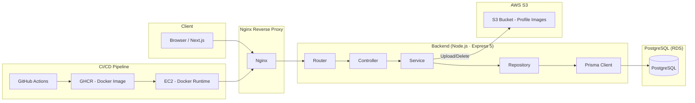
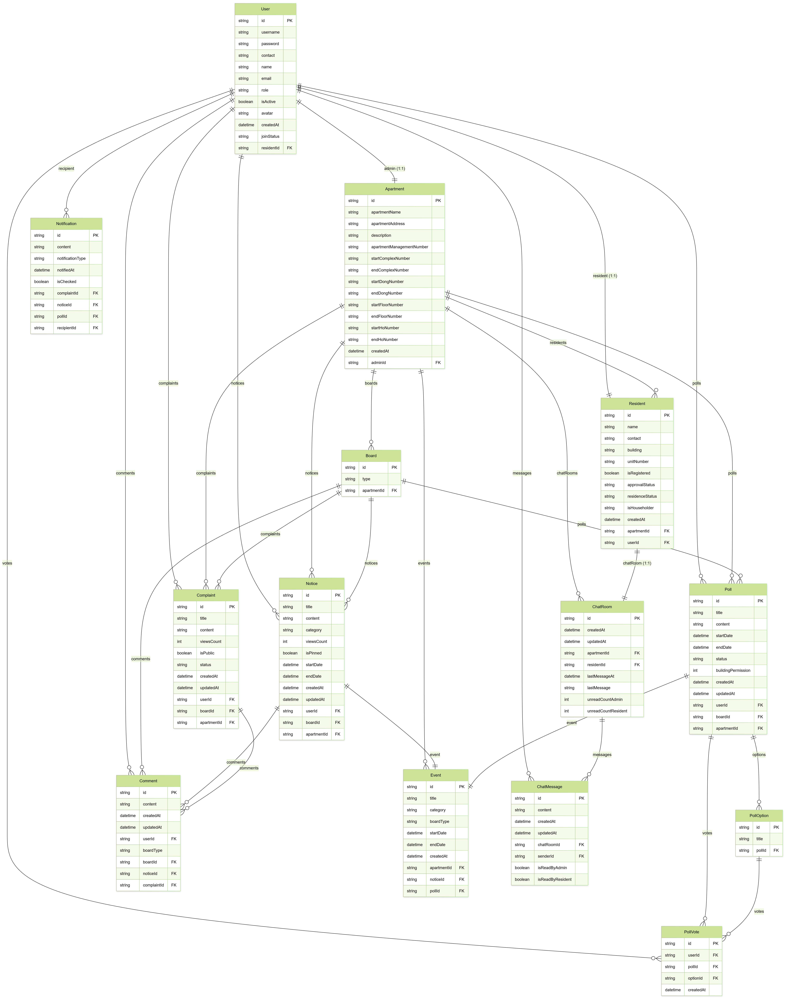
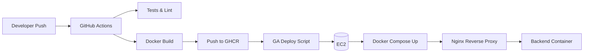

# 🌳 Welive

<p align="center">
  
</p>

## 📌 프로젝트 소개

🌳 **“함께 사는 공간, 함께 만드는 관리.”**  
위리브(Welive)는 입주민과 관리 단체가 한자리에서 소통하고 문제를 해결하며, 더 나은 공동체를 만들어가는 아파트 상호 관리 플랫폼입니다.  
당신의 일상이 더 편해지는 그 순간까지, 위리브가 함께합니다.

## 🔗 데모 & 주요 링크

- Frontend: https://welive.mimu.live
- Backend: https://api.mimu.live
- Swagger 문서: https://api.mimu.live/docs
  - SUPER_ADMIN 계정 로그인 필요
- GitHub Repository: https://github.com/codeit-welive/welive
- 최종 발표 자료: 준비 중
- 시연 영상: 준비 중
- 팀 노션 문서: 준비 중

## 🛠 기술 스택

### Backend
[]()
[]()
[]()
[]()
[]()

### Infra / DevOps
[]()
[]()
[]()
[]()
[]()

### Testing & Quality
[]()
[]()
[]()
[]()

### Frontend (협업 / 참고)
[]()

---

### 🧭 기술 스택 채택 이유

**Node.js + Express 5**
- 대규모 서비스에서도 검증된 경량 웹 프레임워크로, 라우팅·미들웨어 기반 구조를 세밀하게 설계하기 용이함  
- 비동기 I/O 기반으로 SSE·Socket.io 등 실시간 기능 구현에 적합  
- Layered Architecture 구성 시 Router → Controller → Service → Repository 흐름을 가장 유연하게 설계할 수 있음

**TypeScript**
- 도메인 단위로 타입을 엄격하게 정의해 대규모 모듈 간 의존성을 안정적으로 유지  
- DTO·Validator·Repository 등 계층 간 데이터 계약을 명확히 보장  
- Prisma와 결합하여 컴파일 단계에서 DB 스키마 오류를 조기 감지할 수 있음

**Prisma + PostgreSQL**
- Prisma의 스키마 기반 ORM은 모델 변경 및 마이그레이션 관리가 직관적이며, 대규모 테이블 조인 구조에서도 타입 안전성을 제공  
- PostgreSQL은 트랜잭션 강도가 높아 Poll Scheduler·알림·대량 CSV 처리 등 동시성 요구에 안정적으로 대응

**Docker + Nginx**
- 개발·테스트·운영 환경을 완벽하게 동일하게 유지할 수 있어 배포 안정성이 높음  
- Nginx Reverse Proxy를 통해 SSL, 정적 자원 서비스, CORS, 헤더 보안 등을 단일 진입점에서 제어 가능  
- BE(컨테이너) + FE(PM2) 조합으로 초기 로딩 시간을 최적화하면서도 CI/CD 자동화에 유리

**AWS(EC2, S3)**
- EC2는 Docker 환경 배포에 직관적이며 확장 및 유지보수가 용이  
- S3는 이미지·정적 파일 저장에 안정적이며, Presigned URL 기반 업로드로 보안 수준을 크게 높일 수 있음

**GitHub Actions + GHCR**
- 푸시 이벤트 기반으로 테스트 → 빌드 → 이미지 생성 → 서버 자동 배포까지 완전 자동화  
- GHCR 사용으로 이미지 버전 관리 및 롤백이 용이하며, 사설 레지스트리보다 설정이 단순

**Jest + Supertest**
- DB 연동 테스트, SSE 전달 테스트, 스케줄러 동작까지 검증 가능한 구조  
- 테스트 DB를 별도로 구성해 실제 Prisma 트랜잭션 흐름을 그대로 재현 가능  

---

### 🧩 주요 패키지 채택 이유

- **Zod**: DTO/Query/Params를 스키마 기반으로 통합 관리하여 검증 일관성을 보장  
- **DOMPurify + jsdom**: 서버단 Sanitization으로 XSS 공격 차단 (FE에서 조작하더라도 무효화)  
- **sharp**: 이미지 리사이즈 및 Magic Number 기반 MIME 검증을 통한 파일 위장 공격 방지  
- **Limiter(직접 구현)**: Poll 스케줄러 동시성 제어(단일 실행 보장)  
- **Socket.io / SSE**: 채팅 + 실시간 알림 각각의 특성을 활용한 이중 실시간 처리 구조  

---

## 🚀 핵심 기능 요약

- **역할 기반 인증/승인 프로세스**  
  - 입주민 · 관리자 · 슈퍼관리자 등 역할별 회원가입, 승인 요청, 승인/거절 흐름

- **입주민 명부 관리**  
  - CSV 업로드, 검색/필터링, 페이징, 일괄 정리 기능 제공

- **공지사항 / 민원 / 댓글 시스템**  
  - CRUD, 카테고리, 조회수, 비공개 처리, 수정 제한 등 운영 기능 포함

- **실시간 알림 시스템 (SSE)**  
  - 민원/공지/투표 상태 변경 시 즉시 알림 이벤트 전달

- **주민 투표 시스템 (Polls)**  
  - 투표권자 범위 설정, 자동 오픈/마감, 실시간 참여, 결과 자동 집계

- **이벤트 캘린더 (관리자용)**  
  - 아파트 내 일정 관리 및 공지와 연동되는 이벤트 CRUD 제공

- **실시간 채팅 (Socket.io)**  
  - 입주민–관리자 간 빠른 응대를 위한 실시간 메시징 기능

- **프로필 이미지 업로드 (S3 Presigned URL)**  
  - Magic Number 기반 검증으로 위장 파일 차단, 안전한 파일 처리

- **동시성 제어 기반 스케줄러 (Limiter)**  
  - Poll 자동 활성화/만료 시 단일 실행 보장 및 경쟁 조건 방지

> 위리브는 학습용 예제가 아니라, 실제 아파트 관리 도메인을 고려한  
> ‘기능·보안·확장성 중심의 실전 프로젝트’로 설계되었습니다.

## 🏛 시스템 아키텍처



## 🗂 Database ERD

<p align="center">
  
</p>

### 📌 주요 테이블 관계 요약

- **Apartments → Residents** : 한 아파트에는 여러 입주민이 소속  
- **Residents → Complaints / Notices / Comments** : 입주민이 작성한 민원·공지·댓글과 연결  
- **Polls → PollVotes** : 투표 1개에 여러 투표 기록이 종속  
- **Complaints / Notices / Polls → Events** : 모든 주요 활동은 이벤트 로그로 기록  
- **Events → Notifications** : 상태 변경 시 알림(SSE)로 연동  
- **Users → Residents** : 주민 계정과 사용자 계정의 1:1 매핑 구조  

> ERD는 Prisma Schema 기반으로 자동 생성되며,  
> 관계형 모델을 통해 권한/역할 기반 관리, 실시간 알림, 투표 시스템 등  
> 주요 기능을 일관된 구조로 확장할 수 있도록 설계했습니다.

## 🏗 시스템 구조 (Layered Architecture)

위리브 백엔드는 **Express 5 기반의 Layered Architecture**로 구성되어 있으며,  
각 레이어가 명확한 역할을 가지도록 설계해 유지보수성과 확장성을 높였습니다.

### 🔹 Layer 구성

- **Router Layer**
  - 요청 엔드포인트 정의 및 모듈 단위 라우팅 구성  
  - 인증/인가, CSV 검증, Sanitization 등 공통 미들웨어 적용 지점

- **Controller Layer**
  - HTTP 요청/응답 처리  
  - 서비스 호출 전 입력값 검증(Zod) 및 예외 흐름 통제  
  - Swagger 자동 문서화 주석 위치

- **Service Layer**
  - 비즈니스 로직 중심  
  - 권한 검증, 트랜잭션 처리, 도메인 규칙 적용  
  - SSE 알림 트리거, Poll 스케줄러 호출 등 핵심 로직 담당

- **Repository Layer**
  - Prisma 기반 데이터베이스 접근  
  - 복잡한 쿼리/조인/트랜잭션을 캡슐화하여 Service와 분리

- **Prisma Client Layer**
  - PostgreSQL과 직접 통신  
  - 타입 세이프티 제공 및 스키마 기반 모델 관리

### 🔹 추가 서브 시스템

- **Input Sanitization (DOMPurify + jsdom)**  
  댓글/공지/민원 등 사용자 입력 필드에 대해 서버 단에서 HTML 정화 수행

- **Validation Layer (Zod)**  
  Params/Query/Body를 스키마 기반으로 통합 검증하여 Controller에 도달하기 전 데이터 무결성 보장

- **SSE Notification Layer**  
  알림 emitter를 별도 모듈로 분리해 Poll/민원/공지 등의 이벤트를 실시간으로 전송

- **Poll Scheduler (Limiter 기반 단일 실행 보장)**  
  Poll 자동 오픈/만료를 Cron + Limiter 조합으로 구현해 경쟁 조건을 방지

- **Socket Layer (실시간 채팅)**  
  입주민–관리자 간 실시간 메시징을 Socket.io로 처리 (JWT 인증 미들웨어 포함)

> 이 레이어 구조는 **도메인 확장·테스트·보안·배포**의 모든 과정에서 일관된 흐름을 유지하며,  
> 대규모 서비스 구조로 확장해도 안정적으로 유지될 수 있도록 설계되었습니다.

## 🔐 보안 설계 (Security Overview)

위리브는 **Express 5 기반 다층 보안 구조**를 적용해  
입력 검증부터 파일 업로드, 인증, 서버 헤더까지 전반적인 보안 리스크를 최소화했습니다.

### 🔹 HTTP 보안 헤더 & 서버 보호
- **helmet(CSP 적용)**: 스크립트/이미지/프레임 정책 강화로 XSS·Clickjacking 방지  
- **X-Powered-By 제거**, **ETag 비활성화**로 프레임워크 노출 및 캐싱 기반 공격 완화  
- **HPP(HTTP Parameter Pollution) 차단** 적용

### 🔹 인증 & 권한
- **JWT Access / Refresh Token 구조**  
- Refresh Token은 **DB 상태 관리 방식**으로 구현해 재발급 시 기존 토큰 무효화  
- 라우터 단위로 **역할 기반 접근 제어(Role-based Access Control)** 적용

### 🔹 CORS & Proxy 환경
- Strict Origin 기반 CORS 화이트리스트  
- `trust proxy` 설정으로 Nginx 뒤에서 IP/프로토콜 정보 정확히 파싱

### 🔹 입력 검증 & Sanitization
- **Zod 스키마** 기반 Params/Query/Body 정형적 검증  
- 사용자 입력값은 **DOMPurify + jsdom** 기반 서버단 Sanitization으로 XSS 차단  
- CSV 업로드 시 **정확한 헤더·타입 검증 및 전체 트랜잭션 처리**

### 🔹 파일 업로드 보안
- 이미지 업로드는 확장자가 아닌 **Magic Number(MIME) 기반 검증**  
- sharp를 이용한 **강제 재인코딩(재압축)으로 “폴리글롯(polyglot) 파일” 차단**  
  - 예: JPEG/PNG로 위장한 스크립트·실행파일 혼합 페이로드 강제 제거  
- 재인코딩 후에만 Presigned URL 기반 S3 업로드 허용  
- 위장 파일(예: PNG 헤더 + JS 페이로드) 즉시 거부

### 🔹 Rate Limiting & 서버 보호
- **express-rate-limit**: IP 단위 요청 제한 적용  
- JSON Body 사이즈 제한(2MB), URL-encoded 제한

### 🔹 실시간 통신 보호
- **SSE 알림**: JWT 기반 인증  
- **Socket.io 채팅**: Connection middleware로 인증 후 소켓 확립

### 🔹 에러/로깅
- Pino 기반 구조적 로깅  
- 글로벌 에러 핸들러로 내부 스택 숨김 & 일관된 에러 응답 포맷 유지

> 입력 검증, Sanitization, 재인코딩 기반 파일 보안, JWT 인증, CSP 등  
> 여러 보안 계층을 적용하여 안정성과 신뢰성을 강화했습니다.

## 🚢 CI/CD & 배포 구조

위리브는 **Docker 기반 프로덕션 환경 + GitHub Actions 자동 배포 파이프라인**을 구축하여  
개발 → 빌드 → 테스트 → 배포의 전 과정을 자동화했습니다.

### 🔹 CI/CD 흐름

1. **GitHub Actions(CI)**
   - PR/commit 시 자동으로 테스트 실행(Jest)
   - 타입 체크/ESLint 검사 통해 품질 유지
   - 모든 테스트 통과 시 Docker 이미지 빌드

2. **GHCR(GitHub Container Registry)**
   - 빌드된 Docker 이미지를 태그 버전으로 업로드  
   - 이미지 버전 관리 및 롤백이 용이

3. **GitHub Actions(CD) – EC2 자동 배포**
   - SSH를 통해 EC2에 접속  
   - 최신 이미지 Pull  
   - `docker-compose.prod.yaml` 기반으로 컨테이너 재기동  
   - 환경 변수 파일(.env.prod) 자동 생성/동기화

4. **EC2(Docker Runtime)**
   - Backend 컨테이너 단일 실행  
   - 로그 관리(Pino 파일 저장), 헬스체크 포함

5. **Nginx Reverse Proxy**
   - 요청 라우팅: `FE → / (Next.js)` / `BE → /api`  
   - Cloudflare Origin 복원, gzip 압축, CORS/보안 헤더 일괄 관리  
   - SSL(TLS) 종단 처리

### 🔹 배포 구조 요약



### 🔹 주요 특징

- **완전 자동 배포**: Git push만으로 테스트 → 빌드 → 배포까지 자동 처리  
- **환경 분리**: `.env`, `.env.test`, `.env.production` 분리 로드  
- **선택적 재배포**: API 변경 없이 특정 모듈만 재배포 가능  
- **에러 방지 장치**: Swagger 미생성 시 서버 기동 차단, 프록시/포트 자동 검증  
- **운영 안정성 강화**: Docker 이미지 기반으로 동일한 실행 환경 보장  

## 📂 디렉터리 구조 (요약)

프로젝트는 **Layered Architecture + 도메인 모듈 구조**로 구성되어 있으며,  
핵심 책임 단위가 명확하게 분리되어 유지보수성과 확장성을 높였습니다.

```
welive/
├── infra/ # Docker, nginx, 배포 설정
│ ├── docker/
│ └── nginx/
│
├── prisma/ # Prisma 스키마 및 마이그레이션
│ ├── schema.prisma
│ └── migrations/
│
├── src/
│ ├── core/ # 앱 코어 (env·logger·middlewares·sse·socket 등)
│ ├── modules/ # 도메인 모듈 (auth, residents, polls, notices 등)
│ ├── jobs/ # Poll Scheduler
│ ├── @types/ # 글로벌 타입 확장
│ └── index.ts # 서버 엔트리포인트
│
├── tests/ # Core / Modules / Scheduler 통합 테스트
│ ├── core/
│ ├── modules/
│ └── jobs/
│
├── swagger/ # 자동 생성된 Swagger JSON
├── scripts/ # Swagger 생성 등 스크립트
└── package.json
```

### 📌 구조 특징
- **core**: 인증/CORS/Sanitize/Error 핸들러, SSE, Socket, Limiter 등 공통 시스템 레이어  
- **modules**: Router → Controller → Service → Repository → Prisma 구조를 따르는 도메인 단위 구현  
- **jobs**: Poll 자동 오픈/만료 스케줄러  
- **tests**: 실제 DB 기반 통합 테스트 (테스트용 DB 자동 초기화)

## ⚙️ 실행 가이드 (Run & Setup Guide)

### 1) 환경 변수 설정 (`.env`)
`.env.example` 파일을 참고해 개발/테스트/운영 환경에 맞게 `.env`, `.env.test`, `.env.production`을 구성합니다.

```env
# DATABASE
DATABASE_URL=postgresql://<user>:<password>@localhost:5432/welive

# SERVER
PORT=3001
FE_PORT=3000
CORS_ORIGIN=http://localhost:3000

# JWT / AUTH
ACCESS_TOKEN_SECRET=your_access_token_secret
REFRESH_TOKEN_SECRET=your_refresh_token_secret
PASSWORD_PEPPER=your_pepper

# AWS S3
AWS_REGION=ap-northeast-2
AWS_S3_BUCKET_NAME=your_bucket
AWS_S3_BASE_URL=https://your_bucket.s3.ap-northeast-2.amazonaws.com
```

### 2) 패키지 설치
```bash
npm install
```

### 3) 데이터베이스 초기화 (Prisma)
개발/테스트 환경 모두 Prisma 스키마 기반으로 초기화합니다.

```bash
npm run prisma:migrate      # 마이그레이션 + 시드 전체 수행
npm run prisma:generate     # Prisma Client 생성
npm run prisma:reset        # 개발 DB 초기화
npm run prisma:studio       # DB UI (웹)
```

테스트 환경에서 DB 초기화:
```bash
npm run test:reset
npm run test:migrate
```

### 4) 개발 서버 실행
백엔드/프론트를 동시에 개발하기 위한 스크립트 포함.
```bash
npm run dev        # BE + FE 동시 실행
npm run dev:be     # 백엔드 단독 실행
npm run dev:fe     # 프론트 단독 실행
```

### 5) 테스트 실행
테스트 환경(`.env.test`)이 자동 로드되며,  
테스트용 DB는 매 실행마다 초기화됩니다.

```bash
npm test            # 전체 테스트
npm run test:watch  # 변경 감지
npm run test:cov    # 커버리지
```

### 6) 빌드
```bash
npm run build
```
빌드 후 결과는 `dist/`에 생성되며 `tsc-alias`로 경로 alias가 자동 변환됩니다.

### 7) 프로덕션 실행
- **백엔드**: Docker 기반 (EC2)  
- **프론트엔드**: PM2 기반 Next.js 실행

```bash
npm start        # BE + FE
npm run start:be # 백엔드만
npm run start:fe # 프론트만
```

중지:
```bash
npm run stop
```

테스트/운영 DB 혼용을 방지하기 위해  
`.env.test`에는 운영 DB 정보를 절대 저장하지 않도록 설계되어 있습니다.

## ✨ 주요 구현 하이라이트 (Key Implementations)

### 🔹 1) 역할 기반 인증/인가 구조 (RBAC)
- JWT Access/Refresh Token + DB 기반 Refresh 상태 관리  
- SUPER_ADMIN / ADMIN / USER 3단 역할을 라우터 단위로 제어  
- 승인 대기/거절/추가 정보 필요 등 입주민 상태 흐름을 상세하게 모델링

### 🔹 2) 실시간 알림 시스템 (SSE)
- 민원·공지·투표 등 주요 이벤트 발생 시 즉시 알림 전송  
- SSE 전역 Emitter 모듈화 → 서비스 레이어에서 단일 API로 사용  
- 프론트는 알림 Store와 연결되어 실시간 UI 반영

### 🔹 3) Poll 스케줄러 (자동 오픈/마감)
- Cron 기반 자동 스케줄러 구현  
- **Limiter(직접 구현)** 로 단일 실행 보장 → 중복 처리/경쟁 조건 제거  
- 만료 시점에 자동 집계 + 알림까지 일괄 처리

### 🔹 4) 파일 업로드 보안 설계
- 확장자 기반이 아닌 **Magic Number(MIME)** 검증  
- `sharp` 재인코딩으로 **폴리글롯(polyglot) 파일 공격** 차단  
- Presigned URL 방식으로 S3 직접 업로드

### 🔹 5) HTML Sanitization & 입력 검증
- 서버단 DOMPurify + jsdom으로 XSS 방지  
- Zod 스키마 기반으로 Params/Query/Body 통합 검증  
- 검증(Zod) → Sanitize → Controller 흐름으로 전 계층 보호

### 🔹 6) Socket.io 기반 실시간 채팅
- JWT 인증 미들웨어로 사용자 검증  
- 관리자 ↔ 입주민 간 빠른 응대 구조 확립  
- 메시지 저장, 읽음 처리, 채팅방 단위 관리

### 🔹 7) CSV 기반 입주민 명부 업로드
- CSV 헤더/타입 정확 검증  
- 대량 업로드 시 전체를 단일 트랜잭션으로 처리  
- 잘못된 데이터는 line 단위로 즉시 오류 제공

### 🔹 8) 테스트 코드 & 안정성
- 전체 도메인 모듈 통합 테스트 구성 (Jest + Supertest)  
- 테스트 환경 전용 DB(`setupTestDB`) 자동 초기화  
- Scheduler·SSE 이벤트까지 독립적으로 검증 가능하도록 구조화

### 🔹 9) 안정적인 운영 환경
- Swagger 미생성 시 서버 부팅 차단  
- healthcheck 기반 Docker 컨테이너 상태 확인  
- Nginx + Cloudflare Origin Restore + gzip 압축 조합

> 본 프로젝트는 Layered Architecture, 도메인 기반 설계, 테스트·보안·배포 자동화를 모두 갖춘  
> 실제 운영 수준의 백엔드 아키텍처를 목표로 구현되었습니다.
> 
> 또한 모듈 책임 분리, 스프린트 단위 일정 관리, GitHub PR 기반 협업으로  
> 실제 팀 개발 흐름에 맞춘 운영 프로세스를 유지했습니다.

## 📎 부록 & 산출물 (Official Project Documents)

아래 문서는 프로젝트의 전 과정을 정리한 **구글 독스 기반 공식 산출물**입니다.

- **1. 요구사항 분석**  
  https://docs.google.com/document/d/11Kl92rqan2iA_5K8Q_3UCQXxkDiuzfVb10B0d-X-JTQ/edit?usp=sharing

- **2. 시스템/DB 설계**  
  https://docs.google.com/document/d/1cymp9U-yK94KXXUE7jiBzh5EP23w9luxXiKN50FrFGA/edit?usp=sharing

- **3. 구현 문서**  
  https://docs.google.com/document/d/1hgKMj29_KXsSXFceEgQGOPSlGxUAqYg32ujF5OWZd2U/edit?usp=sharing

- **4. 테스트 문서**  
  https://docs.google.com/document/d/1Dnkksd0Oa1b5dHiuudu5tm-BDBxiOFkTnExfLzwxJVw/edit?usp=sharing

- **5. 배포 및 유지보수 문서**  
  https://docs.google.com/document/d/1Pq4H3DNUBoLCKIp0Jdt3oD8kg3pb66YLEaR4uXr8KJg/edit?usp=sharing

> [!NOTE]  
> 상단의 “🔗 데모 & 주요 링크”는 실행 가능한 서비스/코드 접근용,  
> 본 섹션은 프로젝트 진행 전체를 다룬 **정식 문서 산출물 모음**입니다.
